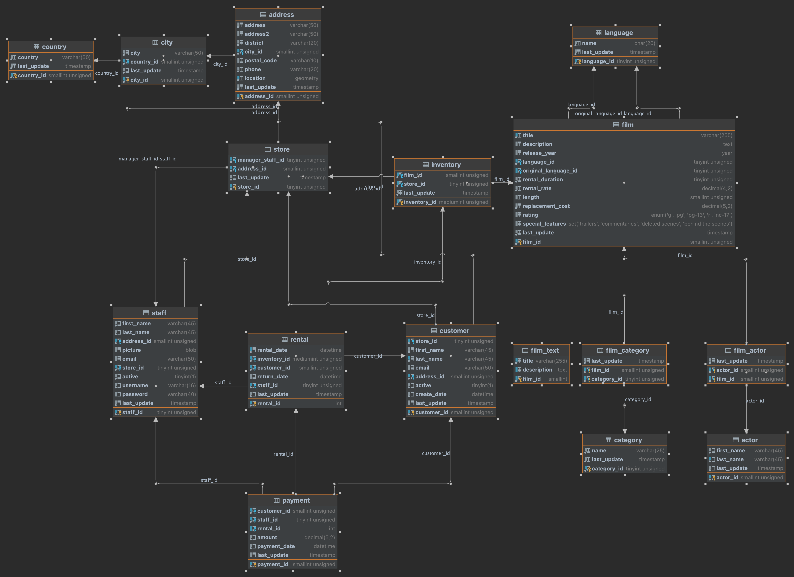

# Set Up
- MySQL schema and data:
  - https://github.com/datacharmer/test_db/tree/master/sakila
- 

## Running Mysql Logging 
```sql
# check if logging is on 
SHOW VARIABLES LIKE "general_log%"; 

# if logging is off 
SET GLOBAL general_log = 'ON';

# make sure logging is off 
SET GLOBAL general_log = 'OFF';
```
View logs example 
```shell
tail -f /var/run/mysqld/mysqld.log
```